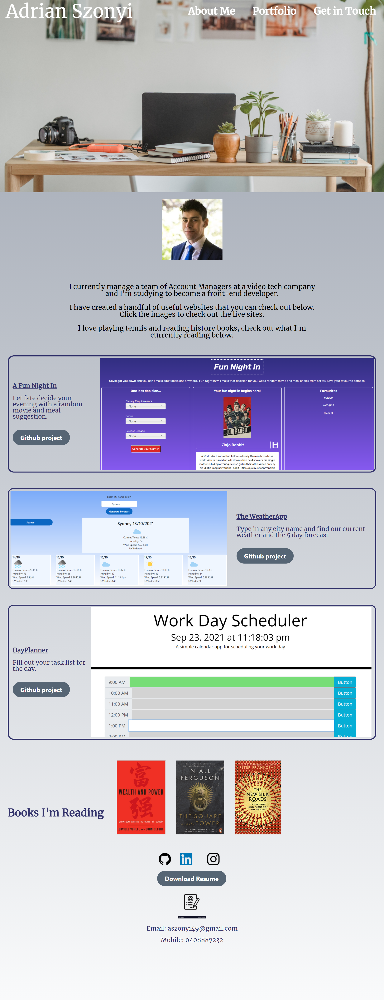

# Homework Week 2: Adrian Szonyi's Portfolio

## Description

I have built this website to showcase some of my previous development projects and provide a description of myself for future employers. I will continue to update this site as I create new works. I was motivated to create this so that I can have an easy way to share and showcase the projects I am working on. I've learnt a lot about flex design for building mobile responsive websites.

* The whole website is responsive, through the use of flexbox and media queries

* I added a section on the books I am reading/have already read so that it is a bit more personalised

* The images can be clicked to link to my other projects

## Installation

Here is the link to view the updated website page:
[Adrian's Portfolio website link](https://adrian-szonyi.github.io/AdrianSzonyiPortfolio/)

You can click on the links in the nav bar and it will redirect you to the relevant sections of the website. You can also click on the images in the MyWork section or the headers and this will take you to some of my previous projects.

## Technologies Used

* HTML
* CSS
* Tailwind CSS library

## Credits

I have sourced images from [Pexels](https://www.pexels.com/) a free stock imagery library. Credit to the following image creators:

* The cover image was created by Goerge Milton: [Pexels-link](https://www.pexels.com/photo/table-with-laptop-and-photo-camera-7014946/)

## Website Image

